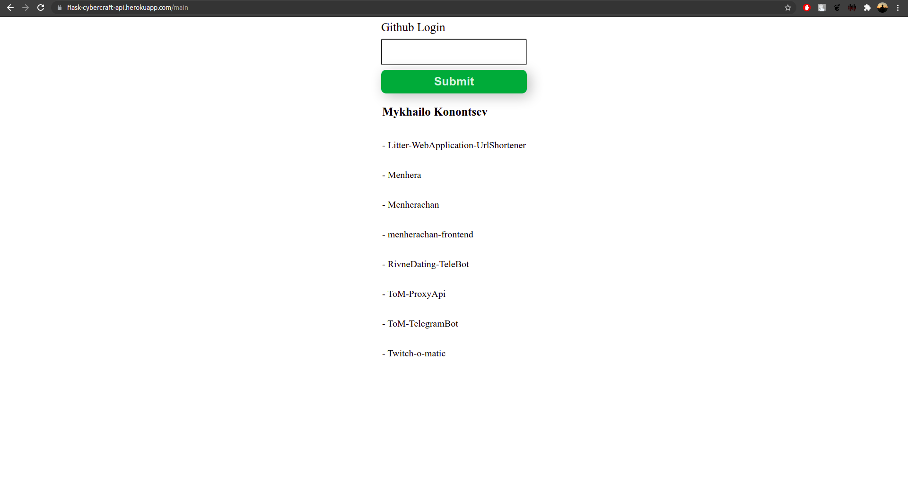
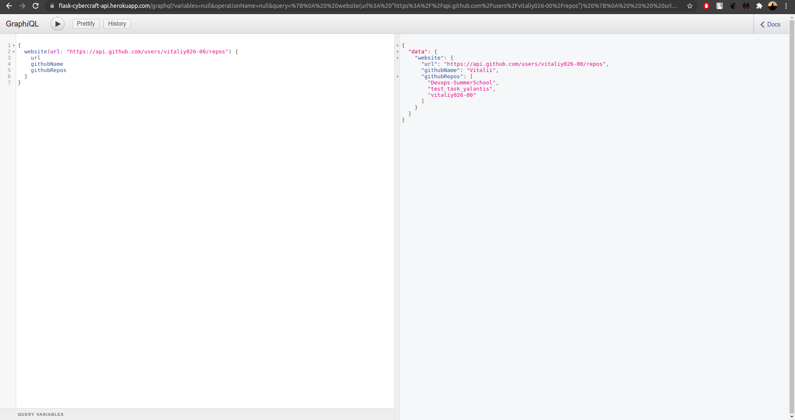

# Test task for Cybercraft

### Description

This is a test task for Cybercraft.

### How this API looks

This is how API looks by this url(https://flask-cybercraft-api.herokuapp.com/main)

In this input field we write github login and receives github name and repositories names as a result.

This is how API looks by this url(https://flask-cybercraft-api.herokuapp.com/graphql)

